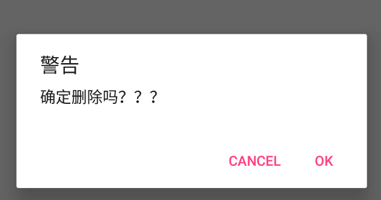

# 弹出对话框（AlertDialog）的使用

[TOC]

需求：

 

## 比较简单，直接看代码

~~~java
//安卓中大部分窗口化的控件好像大部分用的是Builder模式
        // 所以我们先获取一个AlertDialog的建造者实例
        AlertDialog.Builder builder=new AlertDialog.Builder(this);
        
        //设置属性
        builder.setTitle("警告");
        builder.setMessage("确定删除吗？？？");
        builder.setCancelable(false); //不允许按返回键取消
        
        //设置两个按钮
        builder.setPositiveButton("ok", new DialogInterface.OnClickListener() {
            @Override
            public void onClick(DialogInterface dialog, int which) {
                Toast.makeText(MainActivity.this, "已经删除", Toast.LENGTH_SHORT).show();
            }
        });
        builder.setNegativeButton("cancel", new DialogInterface.OnClickListener() {
            @Override
            public void onClick(DialogInterface dialog, int which) {
                Toast.makeText(MainActivity.this, "取消", Toast.LENGTH_SHORT).show();
            }
        });
        
        //显示出Dialog
        builder.show();
~~~

